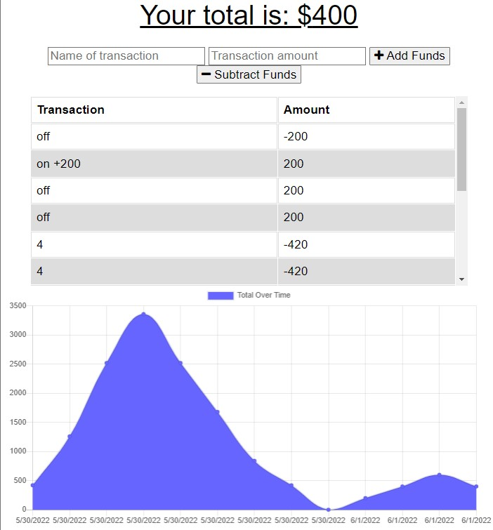
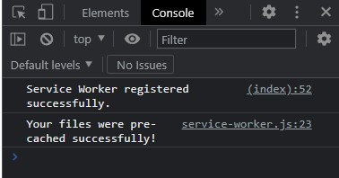

# Budget Tracker
Deployed App: [https://budgettrackerpwaluis.herokuapp.com](https://budgettrackerpwaluis.herokuapp.com)
## ToC
- [Description](#description)
- [Features](#features)
- [Usage](#usage)
- [Preview](#preview)

## Description
Budget Tracker is an app that lets you handle transactions even if you are offline!
## Features 
- express.
- serviceworkers.
- mongoose.

## Usage
Open command line and enter 'npm start', Then open your browser and type 'http://localhost:3001/'

## Preview

